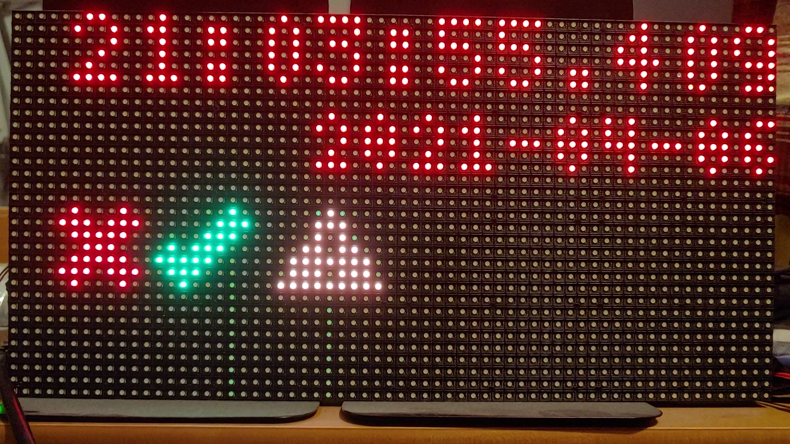

# About rpi-led-matrix-painter
Add drawing facilities to the excellent alexeden/rpi-led-matrix.  Takes a declarative approach to drawing on the matrix.  Manage sections of the board independently, draw shapes, text, images, and some simple effects.

# Example
Check out <a href="https://github.com/wesleytabaka/rpi-led-matrix-painter-example">wesleytabaka/rpi-led-matrix-painter-example</a> for a working example of the library.
<br><br>
Here's an idea of what you can do.<br>


# Installation
Clone this repo into your project with:
```git
git clone https://github.com/wesleytabaka/rpi-led-matrix-painter.git
```
Then install with:
```git
npm install ./rpi-led-matrix-painter --save
```
# API Overview

Import into your app using:
```typescript
import * as Board from "rpi-led-matrix-painter";
```

"Board" will contain the following TS modules:

 - Painter (Class)
    - This is the main class that controls drawing the PaintingInstructions and driving Effects.  You'll have one instance of Painter that you'll need to access to do everything.
 - Canvas (Class)
    - Represents the entire LED matrix and consists of one or more CanvasSections that you define.
 - CanvasSection (Class)
    - A section of the board defined by x, y, width, height, and layer.
 - DrawMode (Enum)
    - Use in your PaintingInstruction to switch DrawModes.  e.g., CIRCLE, RECTANGLE, POLYGON, TEXT, etc.
 - DrawModeOption (Interface)
    - Interface with properties fill?: boolean, font?: string, fontPath?: string, effects?: Effect[]
 - Effect (Interface)
    - Interface with properties effectType: EffectType, effectOptions: EffectOptions
 - EffectOptions (Interface)
    - Consists of the "rate" property for the speed of the effect.
 - EffectType (Enum)
    - One of: SCROLLLEFT, SCROLLRIGHT, SCROLLUP, SCROLLDOWN, BLINK, PULSE.  Others are defined but not implemented.
 - PaintingInstruction (Interface)
    - List of properties defining what to draw and how to draw it.
 - Point (Interface)
    - Defines a point on the CanvasSection relative to the CanvasSection.
 - RpiLedMatrix (Module -- re-export of alexeden/rpi-led-matrix)

# API Detail
Here is the public API.
<br>To get started, create a new Painter instance:
```typescript
import * as Board from "rpi-led-matrix-painter";

export class MyClass {

    private mypainter = new Board.Painter(
        {
            ...Board.RpiLedMatrix.LedMatrix.defaultMatrixOptions(),
            rows: 32, // LED rows per panel
            cols: 64, // LED columns per panel
            chainLength: 2 // Number of panels chained together
        },
        {
            ...Board.RpiLedMatrix.LedMatrix.defaultRuntimeOptions()
        }
    );
}
```

To create a CanvasSection the full size of both panels, assuming they're laid out next to each other horizontally...
```typescript
this.mypainter.getCanvas().addCanvasSection(new Board.CanvasSection("mycanvassection", 0, 0, 1, 128, 32, [], true));
```

To set the new CanvasSection, mycanvassection to read something like "Hello, world!"...
```typescript
this.mypainter.getCanvas().getCanvasSection("mycanvassection")?.setRepresentation([
    {
        id: "helloworld",
        drawMode: Board.DrawMode.TEXT,
        color: 0x800000,
        drawModeOptions: {font: "5x7", fontPath: "/home/pi/code/rpi-led-matrix-painter-test/fonts/5x7.bdf"},
        points: {x: 0, y:0, z: 1},
        text: "Hello, world!",
        layer: 1
    }
]);
```

The CanvasSection.setRepresentation() method takes an array of PaintingInstruction.  The format of this can vary depending on the drawMode.  For example, when using a DrawMode of LINE, the "points" property should be an array of Point.  When using a DrawMode of TEXT, the "points" property should be one Point.  The properties "id", "drawMode", and "color" are all required all of the time.
<br><br>
When you're ready to draw to the Canvas, call paint() on the Painter object...
```typescript
this.mypainter.paint();
```

That's it!  Below is the public API spec.
## Painter (Class)
 - constructor(matrixOptions: Board.RpiLedMatrix.MatrixOptions, runtimeOptions: Board.RpiLedMatrix.RuntimeOptions)
 - resetClock(): void
 - clear(): void
 - getCanvas(): Canvas
 - getFontInstance(name: string, path: string): Board.RpiLedMatrix.FontInstance
 - getImageInstance(imagePath: string): Promise&lt;Image&gt;
 - paint(): void
## Canvas (Class)
 - constructor(matrixOptions: matrix.MatrixOptions, runtimeOptions: matrix.RuntimeOptions)
 - getCanvasSections(): CanvasSection[]
 - getCanvasSection(name: string): CanvasSection | undefined
 - setCanvasSection(name: string, paintingInstructions: PaintingInstruction[]): void
 - addCanvasSection(canvasSection: CanvasSection): void
 - removeCanvasSection(canvasSectionName: string): void
 - setCanvas(canvasSections: CanvasSectionSettings[]): void
## CanvasSection (Class)
- constructor(name: string, x: number, y: number, z: number, width: number, height: number, representation?: PaintingInstruction[], overflow?: boolean)
- get(): CanvasSection
- setRepresentation(paintingInstructions: PaintingInstruction[]): void

## DrawMode (Enum)
- POLYGON
    - PaintingInstruction.points: Point[]
- RECTANGLE
    - PaintingInstruction.points: Point
- CIRCLE
    - PaintingInstruction.points: Point
- ELLIPSE
    - PaintingInstruction.points: Point
- PIXEL
    - PaintingInstruction.points: Point[]
- TEXT
    - PaintingInstruction.points: Point
- IMAGE
    - PaintingInstruction.points: Point
- BUFFER
    - PaintingInstruction.points: Point
- LINE
    - PaintingInstruction.points: Point[]

## DrawModeOption (Interface)
```typescript
interface DrawModeOption {
    fill?: boolean,
    font?: string,
    fontPath?: string,
    effects?: Effect[]
}
```

## Effect (Interface)
```typescript
interface Effect {
    effectType: EffectType
    effectOptions: EffectOptions;
}
```
## EffectOptions (Interface)
```typescript
interface EffectOptions {
    rate: number // Expresses pixels per repaint.
}
```

## EffectType (Enum)
- BLINK
- PULSE
- FADETOBLACK
- FADEUP
- ROTATECLOCKWISE
- ROTATEANTICLOCKWISE
- SCROLLLEFT
- SCROLLRIGHT
- SCROLLUP
- SCROLLDOWN

## PaintingInstruction (Interface)
```typescript
interface PaintingInstruction {
    id: string,
    drawMode: DrawMode,
    points: Point | Point[],
    color: number,
    layer: number,
    drawModeOptions?: DrawModeOption,
    width?: number,
    height?: number,
    text?: string,
    imagePath?: string,
    buffer?: Buffer
}
```

## Point (Interface)
```typescript
interface Point {
    x: number,
    y: number,
    z: number
}
```
## RpiLedMatrix (Module -- re-export of alexeden/rpi-led-matrix)


<br><br>

# Issues and Contributing
For bugs or feature requests create an issue and tag it accordingly.

To contribute, fork and create a Pull Request.
